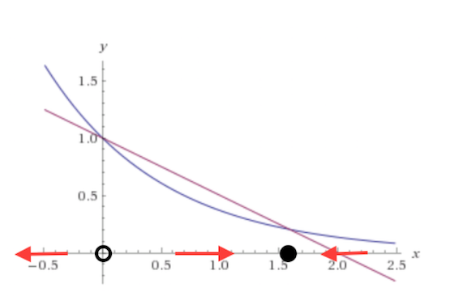

\tableofcontents
\newpage
```{r setup, include=FALSE}
knitr::opts_chunk$set(echo = TRUE)
```


#Model of an Epidemic 

##The Model and Its Assumptions
Kermack and McKendrick (1927) developed the following system of equations to model an epidemic. The population is divided into three categories: healthy people, sick people (i.e. those infected from the epidemic) and those who have deceased as a result of the epidemic. 

$$\dot{x} = -kxy$$
$$\dot{y} = kxy - ly$$
$$\dot{z} = ly$$
**x(t): the healthy population at a time t.** The equation for $\dot{x}$ indicates that the healthy population is decreasing at a rate proportionate to the size of the infected population (y), the number of healthy individuals (x) and a constant rate of infection (k). 

Here we implement our first assumptions: that healthy people are getting infected at a rate proportional to the number of sick (there are no quarantines, for example) and that there is each interaction between a sick individual and a healthy individual has the same constant rate of infection (each individual in the population has roughly the same level of immunity).

 
**y(t):  the size of the infected population at a time t.** 
The equation for $\dot{y}$ indicates that the sick population is increasing at a rate proportionate to the size of the infected population (y), the number of healthy individuals (x) and a constant rate of infection (k), while also accounting for a constant death rate, proportionate to the number of infected individuals (-ly). 

**z(t): the number of individuals who have died from the infection. **
This equation is fairly straightforward, indicating that the number of deaths in the population is proportional to the number of infected individuals, and assuming that there is a constant rate of death due to the infection. 

Remark: In these models, we assume that the total population remains constant, except for deaths due to the epidemic- the changes in population due to births, other causes of death, and
immigration are occurring so slowly that they can be considered constant. This assumption
becomes an issue when considering slower acting epidemics, like AIDS, where there are many
years before an infection is likely to cause death.


It is intuitively obvious that the total population is the sum of the healthy individuals, the infected individuals, and those that have died due to infection, and that this value is a constant. We demonstrate this mathematically: 

Let $N = x+y+z$ such that N is the total population. 
$\frac{d}{dt}(N) = \frac{d}{dt}(x + y+ z) = \dot{x} + \dot{y} + \dot{z} = (-kyz) + (kyz - ly) + (ly) = 0$ Therefore since $\frac{d}{dt}(N) = 0$, we can see that N is a constant. 

##Reducing to a First Order System

We can define an outbreak as a sudden, significant increase in the rates of infection, but these points are not clearly visible in our third-order system. To simplify the calculations for the system, we will reduce system to one equation directly corresponding to the number of dead individuals in the population. Before reducing to a single equation, we can take a look at $\dot{x}$ and solve explicitly for x. Taking $\dot{x}= -kxy$ and $\dot{z}= ly$ $\Rightarrow y = \frac{\dot{z}}{l}$, we can rearrange the equation the following way:
   $$\dot{x} = -kx\frac{\dot{z}}{l}$$
   $$\frac{\dot{x}}{x}= -k \frac{\dot{z}}{l}$$
   $$\int\frac{1}{x}= \int -k \frac{\dot{z}}{l} \frac{dz}{dt}$$
   $$ln(x)= \frac{-k}{l}z +Constant$$
   $$x= e^{\frac{-kz}{l}}e^{Constant}$$
   $$x(t) = x_0e^{\frac{-kz}{l}}$$
Now that we have an equation for x(t), we can use fact that $N = x+ y + z \Rightarrow y = N - x - z$ and plug in our equations for y and x:
$$\dot{z} = ly = l[N - x - z] = l[N - x_0e^{\frac{-kz}{l}} - z]$$
Now we have an equation for $\dot{z}(t)$ that relies on both $\dot{x}(t)$ and $\dot{y}(t)$. 

##Rescaling
Next, we can rescale and reduce the number of parameters to make analysis a bit simpler. Let $u = \frac{kz}{l}$. We can create a new differential equation, $\dot{u}$ that will correspond to the number of dead individuals in the population:
$$\dot{u}= \frac{du}{dt} = \frac{k}{l}\frac{dz}{dt} \Rightarrow \frac{dz}{dt} = \frac{l}{k} \frac{du}{dt}$$
$$\frac{du}{dt} = \frac{k}{l}\frac{dz}{dt}$$
$$=\frac{k}{l}l[N - x_0e^{\frac{-kz}{l}} - z]$$
$$=\frac{k}{l}l[N - x_0e^{\frac{-kz}{l}} - z]$$

$$=k[N - x_0e^{-u} - \frac{l}{k}u]$$
We want to make a time $\tau$ such that $\frac{du}{d\tau} = \frac{du}{dt}\frac{dt}{d\tau} = a - bu - e^{-u}$. Choosing $\frac{dt}{d\tau} = \frac{1}{kx_0} \Rightarrow \tau = kx_0t$. Then $\frac{du}{d\tau} = \dot{u}= \frac{N}{x_0} - \frac{l}{kx_0}u - e^{-u}$. So setting $a = \frac{N}{x_0}$ and $b = \frac{l}{kx_0}$ will complete the nondimensionalization of our system. We now have converted the third order system to a first order system with fewer parameters to simplify the analysis. Moving forward, we can use $\frac{du}{d\tau}  = a - bu - e^{-u} = \dot{u}$

Now showing that $a \geq 1$ and $b > 0$: 
From the previous section, we have that $a = \frac{N}{x_0} = \frac{x_0 + y_0 + z_0}{x_0}$. $x_0$ is the number of healthy people at time t = 0. $y_0$ is the number of sick people at time t = 0. $z_0$ is the number of dead people at time t = 0. The sum of all people at t = 0, i.e. the starting population, will be greater than or equal to the sum of just healthy people at t = 0. Therefore with the numerator of a being greater than or equal to the denominator of a, we have $a \geq 1$.   
Also from the previous section, we have that $b = \frac{l}{kx_0}$. We are given that k and l are positive constants (positive rates corresponding to shifts to different subpopulations). Like previously stated, k and l correspond to the rate of infection and the death rate, respectively. Therefore they will both be greater than 0. $x_0$ is the number of healthy people at time t = 0, so it will also be a positive value. Therefore $b = \frac{l}{kx_0} > 0$.  
*Note: We assume that $x_0 \neq 0$.* 

Now that we know $b = \frac{l}{kx_0} > 0$ and $a \geq 1$, we can focus our analysis of fixed points.  

##Fixed Points
Fixed points occur when $\dot{u} = a - bu - e^{-u} = 0$, i.e. we will have fixed points at $a - bu* = e^{-u*}$. For $a > 1$ and $b > 0$, $u \geq 0$ and there will be one fixed point (a second point for $\dot{u}$ intersects with the u-axis but it occurs when u < 0).  This fixed point is stable, as shown in the below graphs for a >1.  

For $a = 1$ and $b > 0$, $u \geq 0$ there will be two fixed points, although for certain values of b, $\dot{u}$ will intersect with the u-axis outside of the range of $u \geq 0$. So with this restriction, we will only have one fixed point for certain values of b, and will have two fixed points at other values for b. There will always be a fixed point at $u^* = 0$, and will occur at $1 - bu^* = e^{-u^*}$ if $1 - bu^*- e^{-u^*} > 0$. The fixed point at $u^* = 0$ will be unstable, and the fixed point at $1 - bu^* = e^{-u^*}$ will be stable. We have trajectories moving away from 0, and converging toward $u^*$ where $1 - bu^* = e^{-u^*}$. 

 

##The Peak of the Epidemic

If the max of $\dot{u}(t)$ occurs at the same time as the maximum of both $\dot{z}(t)$ and $y(t)$, it means that the number of sick people has reached its maximum at the same time that the number of deaths stops accelerating. This time denotes the peak of the epidemic, as we have more sick people than any other time and the number of deaths at its peak.   

We have the following equations: $\frac{dy}{dt} = kxy - ly$,$\frac{dz}{dt} =ly$ and $\frac{du}{dt} = \frac{k}{l}\frac{dz}{dt}$. Since $\frac{du}{dt} = \frac{k}{l}\frac{dz}{dt} \Rightarrow \frac{d\dot{u}}{dt} = \frac{k}{l}\frac{d\dot{z}}{dt}$, it is clear that the maximum of $\frac{du}{dt}$ will occur at the same time as the maximum of $\frac{dz}{dt}$ (k and l are both positive constants, and $\ddot{u}$ is a scalar multiple of $\ddot{z}$).  

We also have $\frac{d\dot{z}}{dt}=ly(t)$ so $\frac{d\ddot{z}}{dt}=l\frac{dy}{dt}$. Therefore the maximum of $\frac{d\dot{z}}{dt}$ will occur at the same time as the maximum of $y(t)$  (l is a positive constant, and $\ddot{z}$ is a scalar multiple of $\frac{dy}{dt}$).     

Thus this proves the existence of the peak value of the epidemic. After this peak value, the number of dead people decelerates.

## The Threshold 

If $b < 1$, then the epidemic accelerates before slowing down. This will be proved by showing that for $b < 1$, $\dot{u}(t)$ is increasing at t = 0 and reaches its maximum at some time $t_{peak} > 0$. For simplicity, I will use $\frac{du}{d\tau}$ for the calculations. We have $\dot{u} = a - bu - e^{-u}$, therefore $\ddot{u} = - b\dot{u} + \dot{u}e^{-u} = \dot{u}(-b + e^{-u})$. We assume that at t = 0, u(t) = 0, which means there are zero people in the dead subpopulation at the very beginning of the epidemic. Then we have:
$$\ddot{u}_{t=0} = \dot{u}(-b + e^{-u_0}) = \dot{u}(-b + e^{0}) = \dot{u}(-b + 1)$$
At zero, $\dot{u} = a - b(0) - e^0 = a - 1$. As shown previously, $a \geq 1$, therefore at zero $\dot{u}$ will be positive. Since we are assuming that b < 1, (-b+1) will always be positive. Thus $\ddot{u}_{t=0}= \dot{u}(-b + 1) >0$. This tells us $\dot{u}$ is increasing at t = 0. 


Looking at $\ddot{u} = 0$, we have $\dot{u}(-b + e^{-u}) = 0 \Rightarrow -b + e^{-u} = 0 \Rightarrow log(b) =u$. Taking another derivative of $\dot{u}$, we have $\dddot{u} = -e^{-u}$. This will always be negative, so our point $u = log(b)$ is a local maximum, i.e. $\dot{u}$ has a maximum. Since the trajectories for this system converge to a stable equilibrium point, as shown previously, we know that $\lim_{t\to\infty} \dot{u} =0$.

So what happens if $b > 1$? We have that $\ddot{u}_{t=0}= \dot{u}(-b + 1)$ with b > 1 means that $\dot{u}$ decreases from t = 0, i.e. $\dot{u}$ will have its maximum at t = 0. This means that the number of deaths is decelerating from the start (at t = 0). 

This shows us that b = 1 is a threshold point for $\dot{u}$. If b < 1, the system accelerates before slowing down. If b > 1, the system is decelerating from the start, meaning no epidemic actually occurs.


#Revisiting the Model in the Phase Plane (6.5.6) 

Here we revisit the same model of an epidemic in the phase plane. Our equations for healthy population size and infected population size will remain the same, however the new model will omit the equation for the number of deaths, z(t), because it does not have any impact on the dynamics of x and y. This evaluation of the model becomes much easier to analyze. 
$$\dot{x} = -kxy$$
$$\dot{y} = kxy - ly$$
Now, we have a reduction of our third-order system to a second-order system. 

##Fixed Points in the Phase Plane
Taking $\dot{x} = -kxy = 0$ and $\dot{y}= kxy - ly = 0$, we find the following:
The equation for $\dot x$ gives that x = 0 and y = 0 are potential fixed points. Solving for $\dot y$ = 0, we can see that, independent of the value of y, $x=\frac{l}{k}$ is a solution for the system. Looking at the equation for $\dot y$ independently, it gives that y = 0 will always produce a fixed point, so we have a straight line of fixed points at y = 0 for x > 0. In other words, we have fixed points $(x^*,y^*)= (x,0)$ for any x >0. 


First, we will evaluate the Jacobian Matrix:
\[
A = 
  \begin{bmatrix}
    -ky & -kx \\
    ky & kx - l 
  \end{bmatrix}
\]
 at (x,0):
\[
A_{(x,0)} = 
  \begin{bmatrix}
    0 & -kx \\
    0 & kx - l 
  \end{bmatrix}
\]

trace(A) = $kx-l$, and a det(A) = 0. 

The matrix has eigenvalues $\lambda$ = 0, and $\lambda = kx-l$, producing the eigenvector v = (1; -1+k/l). 

When $x< \frac{l}{k}$, 
We have a line of stable fixed points, as you can see in the nullcline graphs. 
From linear analysis, we can also see that $kxy < ly$ (when $x< \frac{l}{k}$) implies that the sign of $\dot y$ is negative, so our trajectories are moving towards our line of fixed points (y=0). 
We assume $l<x$, so if we evaluate $\dot x$, we see that the sign of $\dot x$ is negative, and we are moving toward the y-axis. So for $x< \frac{l}{k}$, we have stable fixed points. 

When $x> \frac{l}{k}$, 
We see a line of unstable fixed points, 

And when $x= \frac{l}{k}$, 
We see a semi-stable fixed point. 

The nullclines for $\dot y$ are found at y=0 and x=l/k. 
The nullcline for $\dot x$ is found on the y-axis. 
In figure below, trajectories are shown in black, and the nullclines are shown in red and blue. 

```{r, echo = FALSE, warning=FALSE, message=FALSE,cache=FALSE, comment = FALSE}
library(phaseR)
sys1 <- function(t, y, parameters) {
  I0 <- parameters
  dy <- numeric(2)
  dy[1] <- -y[1]*y[2] 
  dy[2] <- y[1]*y[2]- y[2]
  return(list(dy))
}

phasePlot <- function(sys, I_0=-1){
  sys.flowField  <- flowField(sys, x.lim = c(0, 10), 
                              y.lim = c(0, 10),
                              xlab="x", ylab="y",
                              parameters = I_0, 
                              points = 30, add = FALSE)  
  sys.nullclines <- nullclines(sys, x.lim = c(0, 10), 
                               y.lim = c(0, 10),
                               parameters = I_0, 
                               points = 100)  
  y0 <- matrix(c(11, 1, 11, 2, 11, .5), 
               ncol = 2, nrow = 3, 
               byrow = TRUE)  
  sys.trajectory <- trajectory(sys, y0 = y0, t.end = 500, 
                               parameters = I_0)
}


phasePlot(sys1, I_0= 0)

```

Continuing to look at our phase portrait, if we begin to the left of the vertical line $x = \frac{1}{x}$, the trajectories are drawn toward our line of stable fixed points, and they remain there. If the trajectories start to the right of the line, they eventually cross it.  

Y increases when $\dot y$ > 0, so our epidemic occurs when $\dot y(0) > 0$. 
$k(x(0))*y(0) - l*(y(0))$ implies that this epidemic occurs when $x(0)>l/k$. 

So, an epidemic occurs when the healthy population at the onset of the epidemic is greater than the value $\frac{l}{k}$, the rate of death over the rate of infection. Let's remember back to our first order system. We had determined that for the equation $\dot{u} = a - bu - e^{-u}$, that an epidemic could only occur at b < 1. B was defined as $b = \frac{l}{kx_0}$. With $b < 1$ we also must have Rearranging, we get $\frac{l}{kx_0} < 1 \Rightarrow x_0 > \frac{l}{k}$. Thus the previous threshold and calculated initial value for which the epidemic occurs are in agreement. 

##Conservative System
Systems for which an energy equation can be derived (one that is constant over time) are called conservative. Our systems for an epidemic can be shown to have this conserved quantity.

Lets take $\frac{dx}{dy}= \frac{\dot{y}}{\dot x} =\frac{l}{k} \frac{1}{x}-1$. We integrate both sides to find: $y = \frac{l}{x}ln(x) - x + constant$. Therefore, $E(x,y) = - y + x -(\frac{l}{k})ln(x)$ is conserved. This function is constant on all trajectories (we have $\frac{dE}{dt} = 0$).

As time goes on in our system (i.e. $t \rightarrow \infty$) the system approaches a fixed point with $x < \frac{l}{k}$ such that $E(x,y) = - y + x -(\frac{l}{k})ln(x)$. 

#Application: The Ebola Virus
Ebola is a viral illness of which the initial symptoms can include a sudden fever, intense weakness, muscle pain and a sore throat. The rate of infection for this disease is particularly high, as spreads between humans not only by direct contact with infected blood, bodily fluids or organs, but also indirectly through contact with contaminated environments. If contracted, the Ebola virus disease is one of the world’s most deadly diseases. 

We will use the first order system that we constructed in previous sections in order to model and Ebola epidemic. According to the World Health Organization, the infection rate (k) of Ebola is 28% and the death rate (l) is 50%. By using these parameter values, we can observe the effect of altering our initial values for the number of healthy people at the start of the epidemic. Since we assume that there are zero dead individuals at time = 0, the initial value for healthy people will directly determine the number of infected individuals at the start of the epidemic.

The model becomes: 
$$\dot{u} = \frac{N}{x_0} - \frac{.5}{.28x_0}u - e^{-u}$$
where x_0 is the intial number of individuals who have no been infected with Ebola at the start of the epidemic. N is the total number of individuals in the population. Let's arbitrarily chose N = 500, therefore we are making the statement that before Ebola breaks out in our 'town', we have a population of 100 people. (the example population is so small because the scale with larger n was making it more difficult to see and interpret the graphs)

```{r, echo = FALSE, warning=FALSE, message=FALSE,cache=FALSE, comment = FALSE}
u10 <- function(x) 100/10 - (.5/(.28*10))*x - exp(-x) 
u30 <- function(x) 100/30 - (.5/(.28*30))*x - exp(-x) 
u50 <- function(x) 100/50 - (.5/(.28*50))*x - exp(-x) 
u70 <- function(x) 100/70 - (.5/(.28*70))*x - exp(-x) 

curve(u30, type = "l", xlim = c(0,80), ylim = c(0,10), xlab = "u", ylab = "du/dt")
curve(u10, add = TRUE, col = "blue")
curve(u50, add = TRUE, col = "red")
curve(u70, add = TRUE, col = "green")


```
Let's begin by taking a look at the plots of $\dot{u}$ for varying intial values of x_0 (see above). My initial values for comparison are $x_0 = 10$ (blue), $x_0 = 30$ (black), $x_0 = 50$ (red) and $x_0 = 70$ (green). From the graphs, we can clearly see there is a maximum value at which the death rate stops accelerating and begins decelerating. For our chosen initial values of $x_0$, we still have an epidemic occurring. 

To determine the initial values at which no epidemic would occur, we can recall the inequality from the second order system calculations for determining when an epidemic WOULD occur: $x(0)>l/k$. So an epidemic will not occur for x < 1.785714. In other words, there will be no outbreak if there is only one healthy person at the time = 0. 

Additionally from the plot, we can see that eventually, the death rate converges to zero. As far as fixed points go, from the graphs we can see that each initial value for $x_0$ has a fixed point near u = 56. Fixed points for different initial values of healthy people converge at different rates, but towards the same $u^*$. Each of these initial values has a stable fixed point (positive to the left of the fixed point and negative to the right of the fixed point). The stability of these points shows us the death rate converges until reaching zero and until every individual in the population has died.

The blue curve shows the death rate for starting with 10 healthy individuals and 90 infected individuals. We can see that this curve has a much steeper decline that the other curves, and beginning with 70 healthy individuals (30 infected individuals) has the most gradual slope. Comparing the curves by slope, we can see that curves that begin with more individuals infected with Ebola will converge much more rapidly to the entire population being dead, while those with fewer infected individuals will converge to death more slowly. Intuitively, this makes complete sense, as healthy individuals will need to move to the Ebola infected subpopulation before they move to the dead subpopulation, therefore taking up quite a bit more time at slower rates of convergence. 


